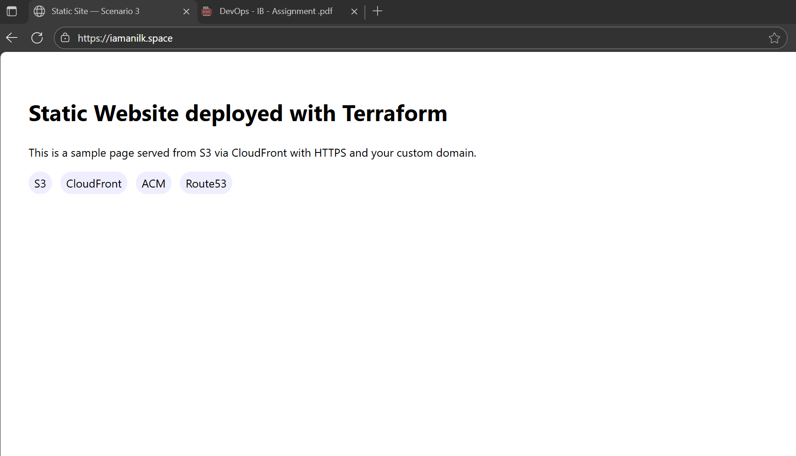

# Scenario 3 — Static Website on AWS (S3 + CloudFront + ACM + Route53)

**🌐 You can browse the website at https://www.iamanilk.space**

**Note: Due to domain cost considerations, a single domain was used for testing all scenarios. Currently, all three scenarios are offline, but each can be fully deployed using the provided Terraform scripts.**

## Overview
This scenario provides a reusable, service-wise Terraform module setup and an example `dev` environment that deploys a secure, scalable static website (primary region defaults to ap-south-1):

- S3 bucket for website content (private)
- CloudFront distribution with Origin Access Control (OAC) to read from S3
- ACM certificate (in us-east-1) for your custom domain
- Route53 alias records pointing your domain to CloudFront
- Optional S3 object uploader to sync local static files

## Structure

- `modules/services/`
  - `s3/` — Private S3 bucket for static site (policy can restrict access to CloudFront)
  - `cloudfront/` — CloudFront distribution with OAC and HTTPS
  - `acm/` — DNS-validated ACM certificate (requires Route53 hosted zone)
  - `route53/` — Alias A records (apex and optional www) to CloudFront
  - `route53_zone/` — Route53 hosted zone management (optional)
  - `s3_objects/` — Optional uploader for local static files using `aws_s3_object`
- `environments/dev/` — Example environment wiring the modules

## Prerequisites

- AWS CLI configured with appropriate credentials
- Route53 hosted zone for your domain (note the `hosted_zone_id`)
- Terraform >= 1.5.0

## Quick start

1) Ensure you have a Route53 public hosted zone for your domain; copy its `hosted_zone_id`.

2) Edit `environments/dev/terraform.tfvars.example` and save as `terraform.tfvars`:
```hcl
project_name   = "my-static-site"
environment    = "dev"
aws_region     = "ap-south-1"

# Your Route53 zone (must exist) and domain
hosted_zone_name = "yourdomain.com"
domain_name      = "yourdomain.com"

# Create www alias too?
create_www = true

# Upload local site files (put content in ../../site)
upload_enabled = false
site_dir       = "../../site"

# CloudFront price class
price_class = "PriceClass_100"
```

3) (Optional) If you want remote state, create `backend.tf` with your state bucket/table. Otherwise delete or comment it out.

4) Initialize and apply from the `environments/dev` folder:

```cmd
cd environments\dev
terraform init
terraform plan
terraform apply -auto-approve
```

When finished, outputs will show your CloudFront domain and the website URL.

## Site Preview

Once deployed, your static website will look like this:



The sample site includes:
- Clean, responsive design
- HTTPS enabled via CloudFront
- Custom domain routing through Route53
- Technology stack indicators (S3, CloudFront, ACM, Route53)

You can customize the content by editing files in the `site/` directory and redeploying with `upload_enabled = true`.

## Configuration Options

| Variable | Default | Description |
|----------|---------|-------------|
| `project_name` | `"static-site"` | Project name prefix for resources |
| `environment` | `"dev"` | Environment name |
| `aws_region` | `"ap-south-1"` | Primary AWS region for S3/Route53 |
| `domain_name` | - | Your domain name (e.g., example.com) |
| `hosted_zone_name` | - | Route53 hosted zone name |
| `create_www` | `true` | Create www subdomain alias |
| `upload_enabled` | `false` | Upload local files to S3 |
| `site_dir` | `"../../site"` | Local directory with static files |
| `price_class` | `"PriceClass_100"` | CloudFront price class |

## Notes

- Primary region for regional services (S3, Route53 interactions, state backend) defaults to `ap-south-1`.
- ACM and CloudFront must be created in `us-east-1`. The dev environment config already provides the alias provider for that.
- The S3 bucket is private and only readable via CloudFront (OAC). Accessing the bucket URL directly will be blocked.
- If `upload_enabled = true`, the module will upload all files from `site_dir` to S3 using `aws_s3_object`.
- Certificate validation requires DNS access to your domain's Route53 zone.

## Cleanup

To destroy the infrastructure:
```cmd
cd environments\dev
terraform destroy
```
